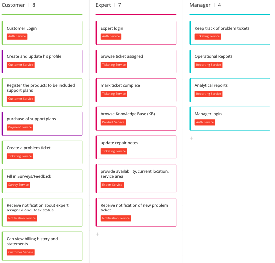
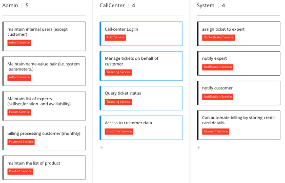

# Problem Background

Description of current problem of Squad Ops
    
## Sysop Squad Actors:
1. Administrator
2. Customer
3. Experts
4. Manager
5. Call Center
6. System

## Use cases for all actors: TODO:Change image to clearer one

## Architecture Attributes 
- Reliability - Tickets Lost, Wrong Expert Assignment.
- Elasticity - Not able to handle burst of tickets.
- Testability and Deployability - Long time to push Changes and breaks and deployment breaks system
- Availability - available for customers and call center
- Observability - ticket lost 
- Scalability - lucrative business, might grow in country
- Security - stores customer and experts personal information (like name, address, contact email, payment details)
- Data integrity - operational reports for managers

## Assumptions:

- Managers do not have critical issues on report system. 
- Experts can not refuse assigned ticket, ticket refusal process is through administrator and assignment handled manually for refused tickets.

For details [Problem Overview](ProblemOverview.md)
