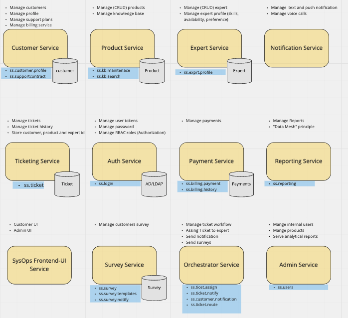

# Solution Overview

## Principles
- Scalability
- Feature Extensibility
- Simplicity
- Measurements and monitoring

## Transition from Monolith to Microservice Model

To accordance with our priciples, we sought for microservices design architecture. This will give the system to scale horizontally and add flexibility to add new features, since we see the growth of the lucritive business across country.

For simplicity, we are keeping the non-problematic components in monolith itself until we move completely to microservice model. This means the transition towards microservice will happen incrementally using Strangular pattern.

To measure the load on the system to boost the performance in recent future, we also focus on measurementns and monitoring.

## Conceptual Models

