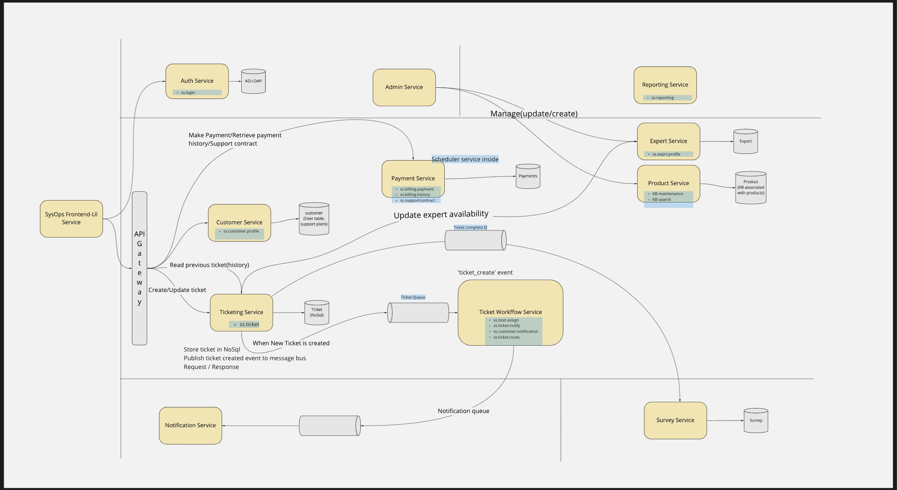

# System Approach

## Final Vision

### Micro-service oriented approach

Final vision is to build a system based on micro services, representing logical parts of the system. Independent services should be easy to develop, test and deploy. Few Identified services would (separated by [bounded context](https://en.wikipedia.org/wiki/Domain-driven_design#Bounded_context)) share common Quality Attributes, so the same set of Tactics can be applied. All those activities should facilitate release of the softer and reduce [time-to-market](https://en.wikipedia.org/wiki/Time_to_market).

But before addressing the quality characteristics of services/bounded context system quality charactersitics must be fulfilled always. These characteristics would be the same throughout.

### System Quality Attributes
**1 Availability**

We want that system should be available most of the time. It should not show system is down to any of the user viz. customer, call center operative or experts etc. Hence we chose Micro-service architecture as it promotes availability.

**2 Testability**

We want system to testable and maintainable. This can also be achieved with micro service architecture.

**3 Data integrity**

We do not want system to show tickets assignment to wrong expert or any sort of discrepancies. This can be achieved by defining clear ownership in microservice arch as well.

**4 Deployability**

System should be deployable quickly and should not take long time. Micro service architecure can achieve that as well. 

**5 Elasticity**

Spike in user request should be handled and there should not be a freeze on website. Microservices can be easily scaled up in an auto scaling group.

**6 Reliability**

System should be reliable even in case of some of the components fail. This is because user perspective is different and do not need to know about the backend system.

## Strangler Pattern Implementation

However to reach there we would be incremently break the monolith away. The order of taking out component would be based on usage, load of the component and how problematic the components is in the current monolith. We will migrate components in the following order:
- Auth 
- Ticketing/ticket workflow
- Payment
- Customer
- Expert
- Notification
- Survey
- Products/KB
- Admin
- Reporting

As per the strangler pattern mentioned in [Strangler Pattern ADR](https://github.com/bhalgat20/ArchitectureKatas2021/blob/main/2.ADRs/StranglerPattern.md) we will have first release which would look like below:

**Auth Components:**

Responsible for authentication and authorization this is a hotspot for the application. We will like to migrate this first. 

**Ticketing Component:**

From our assessment the heart of the reliability problem of the existing monothy is the ticketing service. This component comprises two microservices Ticket and Ticket workflow service.

The ticket service is respondsible for managing all ticket data, while the ticket workflow serice is an asyncronous service that listens on a queue for and acts on specific ticketing events.

| Events  | Action  |
|---|---|
| ticket_created  |  assigned ticket to expert, notifiy expert |
| ticket_upadted  |  notifiy expert and customer |
| ticket_cancelled  |  free up expert for another assignment|

 

The database will be a relational database and will track tickets, customers that created them and experts they are assigned to

The ticket workflow microservice will have a load balance in front of it and it will scale per increase in workload.

**Payment Component:**

This micro servie is respondsible for support plan and billing mangaement. It will be served by a relational database that has the payment, payment method, contract and billing tables migrated to it.

**Customer Component:**

The customer service will be respondsible for managing the customer profile. Tables customer and custome_notification will be migrated to this serivce.

Because this service is prone to spike in traffic, it will also be load balance across instances that can scale.
