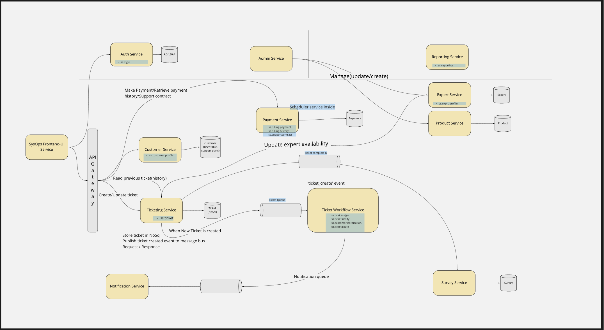
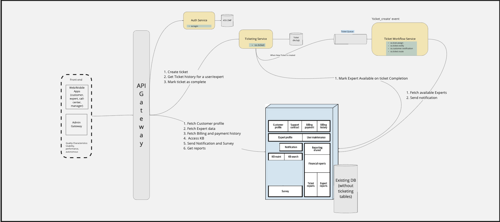

# System Approach

## Final Vision

### Micro-service oriented approach

Final vision is to build a system based on micro services, representing logical parts of the system. Independent services should be easy to develop, test and deploy. Few Identified services would (separated by [bounded context](https://en.wikipedia.org/wiki/Domain-driven_design#Bounded_context)) share common Quality Attributes, so the same set of Tactics can be applied. All those activities should facilitate release of the softer and reduce [time-to-market](https://en.wikipedia.org/wiki/Time_to_market).

But before addressing the quality characteristics of services/bounded context system quality charactersitics must be fulfilled always. These characteristics would be the same throughout.

#### System Quality Attributes
**1 Availability**

We want that system should be available most of the time. It should not show system is down to any of the user viz. customer, call center operative or experts etc. Hence we chose Micro-service architecture as it promotes availability.

**2 Testability**

We want system to testable and maintainable. This can also be achieved with micro service architecture.

**3 Data integrity**

We do not want system to show tickets assignment to wrong expert or any sort of discrepancies. This can be achieved by defining clear ownership in microservice arch as well.

**4 Deployability**

System should be deployable quickly and should not take long time. Micro service arch can achieve that as well. 

**5 elasticity**

Spike in user request should be handled and there should not be a freeze on website. Microservices can be easily scaled up in an auto scaling group.

**6 reliability**

System should be reliable even in case of some of the components fail. This is because user perspective is different and do not need to know about the backend system.

## 1st Release 

### Strangler Pattern

However to reach there we would be incremently break the monolith away. The order of taking out component would be based on usage and load of the component. So the one with high load and usage would be taken out first.

As per the strangler pattern mentioned in [Strangler Pattern ADR](https://github.com/bhalgat20/ArchitectureKatas2021/blob/main/2.ADRs/StranglerPattern.md) we will have first release which would look like below:

